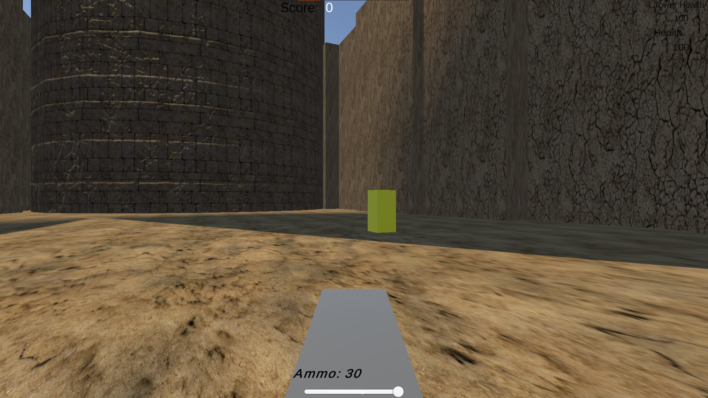

# Defend-Tower
2022 Game Development Assignment

## Gameplay
Defend Tower is a simple tower defence fps game. You must destroy enemies who're spawning from a certain distance.

## In-Game Screenshot

## How to play?
W, A, S and D to move player character.
Space to jump.
Esc to open/close pause menu.
Mouse left-right movement to look around. (Up-down movement coming soon)

## Scripts I wrote 
BulletBehaviour_sc,
Fire_sc,
GameControl_sc,
Tower_sc,
sc_KeepBGM,
sc_MainMenuControls

## https://doctor-aquisio.itch.io/defend-tower

(Assets used are "Yughues Free Ground Material" and "Yughues Free Pavement Materials" from Asset Store)
